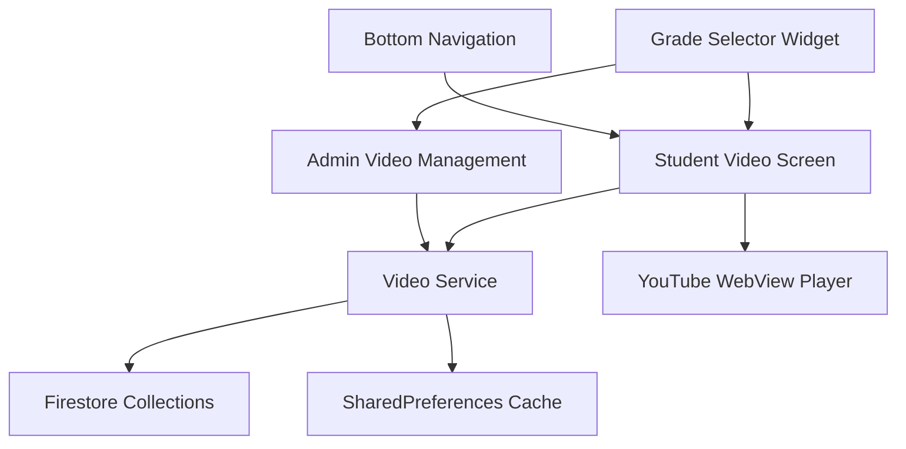

# Video Management System Design Document

## Overview

The Video Management System provides a comprehensive solution for YouTube video organization and playback within the existing Flutter education app. The system follows Flutter Lite principles, integrates seamlessly with existing grade selection patterns, and provides both student viewing and admin management capabilities through a unified architecture.

The design leverages the existing service-based architecture, reuses established UI patterns, and maintains strict performance constraints while delivering a rich video learning experience.

## Architecture

### High-Level Architecture



### Service Layer Integration

The video system integrates with the existing ServiceLocator pattern:

```dart
// Integration with existing ServiceLocator
class ServiceLocator {
  VideoService get videoService => _videoService ??= VideoService();
  // ... existing services
}
```

### Data Flow Architecture

1. **Admin Upload Flow**: Admin → VideoService → Firestore → Real-time listeners → Student devices
2. **Student Viewing Flow**: Student → VideoService → Cache/Firestore → YouTube WebView
3. **Grade Selection Flow**: GradeSelectorWidget → VideoScreen → VideoService → Filtered content

## Components and Interfaces

### Core Components

#### 1. VideoService (lib/services/video_service.dart)
```dart
class VideoService {
  // Core video operations
  Future<List<VideoModel>> getVideosByGrade(String grade, {String? subject});
  Future<void> uploadVideo(VideoModel video);
  Future<void> updateVideo(String videoId, VideoModel video);
  Future<void> deleteVideo(String videoId);
  
  // Real-time synchronization
  Stream<List<VideoModel>> watchVideosByGrade(String grade);
  
  // Caching operations
  Future<void> cacheVideoMetadata(List<VideoModel> videos);
  Future<List<VideoModel>> getCachedVideos(String grade);
  
  // YouTube integration
  Future<VideoMetadata> extractYouTubeMetadata(String url);
  String getYouTubeThumbnailUrl(String videoId);
}
```

#### 2. VideoModel (lib/data/models/video_model.dart)
```dart
class VideoModel {
  final String id;
  final String youtubeId;
  final String title;
  final String description;
  final String grade;
  final String subject;
  final String topic;
  final Duration duration;
  final DateTime uploadedAt;
  final String uploadedBy;
  final bool isActive;
  
  // Serialization methods
  Map<String, dynamic> toJson();
  factory VideoModel.fromJson(Map<String, dynamic> json);
  
  // YouTube URL helpers
  String get thumbnailUrl;
  String get watchUrl;
  String get embedUrl;
}
```

#### 3. VideoScreen (lib/presentation/screens/video_screen.dart)
```dart
class VideoScreen extends StatefulWidget {
  final String selectedGrade;
  
  @override
  _VideoScreenState createState() => _VideoScreenState();
}

class _VideoScreenState extends State<VideoScreen> with TickerProviderStateMixin {
  final VideoService _videoService = ServiceLocator().videoService;
  late AnimationController _animationController;
  List<VideoModel> _videos = [];
  String _selectedSubject = 'All';
  bool _isLoading = true;
  
  // Core methods
  Future<void> _loadVideos();
  void _filterBySubject(String subject);
  void _playVideo(VideoModel video);
  Widget _buildVideoGrid();
  Widget _buildSubjectFilter();
}
```

### UI Components

#### 1. VideoCard (lib/presentation/widgets/video_card.dart)
```dart
class VideoCard extends StatelessWidget {
  final VideoModel video;
  final VoidCallback onTap;
  final bool isWatched;
  
  @override
  Widget build(BuildContext context) {
    return AnimatedContainer(
      // Card with thumbnail, title, duration badge, subject indicator
      // Watched indicator overlay
      // Tap animation and haptic feedback
    );
  }
}
```

#### 2. VideoPlayerModal (lib/presentation/widgets/video_player_modal.dart)
```dart
class VideoPlayerModal extends StatefulWidget {
  final VideoModel video;
  
  @override
  _VideoPlayerModalState createState() => _VideoPlayerModalState();
}

class _VideoPlayerModalState extends State<VideoPlayerModal> {
  late WebViewController _webViewController;
  bool _isLoading = true;
  bool _hasError = false;
  
  // WebView YouTube embed with loading states and error handling
  // Fullscreen toggle and close functionality
  // Progress tracking integration
}
```

#### 3. AdminVideoUploadScreen (lib/presentation/admin/admin_video_upload_screen.dart)
```dart
class AdminVideoUploadScreen extends StatefulWidget {
  @override
  _AdminVideoUploadScreenState createState() => _AdminVideoUploadScreenState();
}

class _AdminVideoUploadScreenState extends State<AdminVideoUploadScreen> {
  String _selectedGrade = 'Grade 1';
  String _selectedSubject = 'Mathematics';
  String _selectedTopic = '';
  final TextEditingController _urlController = TextEditingController();
  VideoMetadata? _previewMetadata;
  
  // Grade/Subject/Topic selectors (reusing existing patterns)
  // YouTube URL input and validation
  // Metadata preview and confirmation
  // Batch upload functionality
}
```

## Data Models

### Firestore Collections Structure

```
/videos/{grade}/{subject}/{topic}/{videoId}
{
  "id": "unique_video_id",
  "youtubeId": "dQw4w9WgXcQ",
  "title": "Introduction to Fractions",
  "description": "Learn basic fraction concepts...",
  "grade": "Grade 4",
  "subject": "Mathematics",
  "topic": "Fractions",
  "duration": 420, // seconds
  "uploadedAt": "2025-01-15T10:30:00Z",
  "uploadedBy": "admin_user_id",
  "isActive": true,
  "thumbnailUrl": "https://img.youtube.com/vi/dQw4w9WgXcQ/maxresdefault.jpg"
}
```

### Local Cache Structure (SharedPreferences)

```dart
// Cache keys
"video_cache_{grade}_{subject}" -> JSON array of VideoModel
"video_watched_{userId}_{videoId}" -> boolean
"video_cache_timestamp_{grade}_{subject}" -> timestamp
"video_subjects_{grade}" -> JSON array of available subjects
```

### YouTube Integration Models

```dart
class VideoMetadata {
  final String title;
  final Duration duration;
  final String thumbnailUrl;
  final String description;
  final bool isValid;
  
  factory VideoMetadata.fromYouTubeUrl(String url);
}

class YouTubeUrlParser {
  static String? extractVideoId(String url);
  static bool isValidYouTubeUrl(String url);
  static String getThumbnailUrl(String videoId, {ThumbnailQuality quality});
}
```

## Error Handling

### Error Types and Responses

1. **Network Errors**
   - Offline mode with cached content
   - Retry mechanisms with exponential backoff
   - Clear user messaging about connectivity requirements

2. **YouTube Integration Errors**
   - Invalid URL validation with user-friendly messages
   - Video unavailability handling (private/deleted videos)
   - Fallback thumbnail loading

3. **Firestore Errors**
   - Permission denied handling for admin operations
   - Quota exceeded graceful degradation
   - Batch operation failure recovery

4. **WebView Errors**
   - YouTube embed loading failures
   - Fullscreen mode issues
   - Memory management for video controllers

### Error Handling Patterns

```dart
class VideoErrorHandler {
  static void handleVideoLoadError(dynamic error, StackTrace stackTrace) {
    if (kDebugMode) {
      debugPrint('Video load error: $error');
    }
    // Show user-friendly error message
    // Attempt cache fallback
    // Log error for admin review
  }
  
  static void handleYouTubeError(String videoId, dynamic error) {
    // Mark video as unavailable
    // Notify admin of broken video
    // Provide alternative content suggestions
  }
}
```

## Testing Strategy

### Unit Testing Approach

1. **Service Layer Testing**
   - VideoService CRUD operations
   - YouTube URL parsing and validation
   - Cache management functionality
   - Real-time listener behavior

2. **Model Testing**
   - VideoModel serialization/deserialization
   - YouTube URL helper methods
   - Data validation and constraints

3. **Widget Testing**
   - VideoCard rendering and interactions
   - VideoScreen grade filtering
   - Admin upload form validation

### Integration Testing

1. **Firestore Integration**
   - End-to-end video upload and retrieval
   - Real-time synchronization testing
   - Batch operation performance

2. **YouTube Integration**
   - Video metadata extraction
   - Thumbnail loading and caching
   - WebView embed functionality

3. **Grade Selection Integration**
   - Grade change propagation to video content
   - Subject filtering within grades
   - Admin and student view consistency

### Performance Testing

1. **Load Testing**
   - Large video list rendering performance
   - Memory usage with multiple video thumbnails
   - WebView controller lifecycle management

2. **Network Testing**
   - Offline/online transition handling
   - Slow network video loading
   - Firestore listener efficiency

3. **Size Impact Testing**
   - APK size increase measurement
   - Tree-shaking effectiveness
   - Asset optimization verification

## Implementation Phases

### Phase 1: Core Infrastructure (Foundation)
- VideoModel and basic VideoService
- Firestore collection structure setup
- YouTube URL parsing utilities
- Basic caching with SharedPreferences

### Phase 2: Student Video Viewing
- VideoScreen with grade integration
- VideoCard component with animations
- VideoPlayerModal with WebView
- Subject filtering and search

### Phase 3: Admin Video Management
- AdminVideoUploadScreen with selectors
- YouTube metadata extraction
- Video management (edit/delete)
- Batch upload capabilities

### Phase 4: Advanced Features
- Real-time synchronization
- Offline capability enhancement
- Performance optimization
- Analytics and usage tracking

### Phase 5: Polish and Optimization
- Animation refinements
- Error handling improvements
- Performance monitoring
- User experience enhancements

## Security Considerations

### Admin Access Control
- Reuse existing admin authentication system
- Video upload permissions validation
- Audit logging for admin actions
- Secure Firestore rules for video collections

### Content Validation
- YouTube URL validation and sanitization
- Content appropriateness checks (manual admin review)
- Video availability monitoring
- Malicious URL protection

### Data Privacy
- Minimal user data collection for video tracking
- Local storage of viewing preferences
- COPPA compliance for student data
- Secure transmission of video metadata

## Performance Optimizations

### Flutter Lite Compliance
- Maximum 150 lines per file
- Minimal dependency additions (webview_flutter only)
- Efficient widget rebuilding with proper keys
- Memory-conscious video controller management

### Firestore Optimization
- Batch reads and writes for cost reduction
- Efficient query patterns with proper indexing
- Real-time listener optimization
- Incremental sync for large video collections

### Caching Strategy
- LRU cache eviction for video metadata
- Thumbnail caching through YouTube CDN
- Offline-first approach for video lists
- Smart cache invalidation based on timestamps

### UI Performance
- ListView.builder for efficient scrolling
- Image loading with proper placeholder states
- Animation optimization with proper disposal
- WebView lifecycle management for memory efficiency